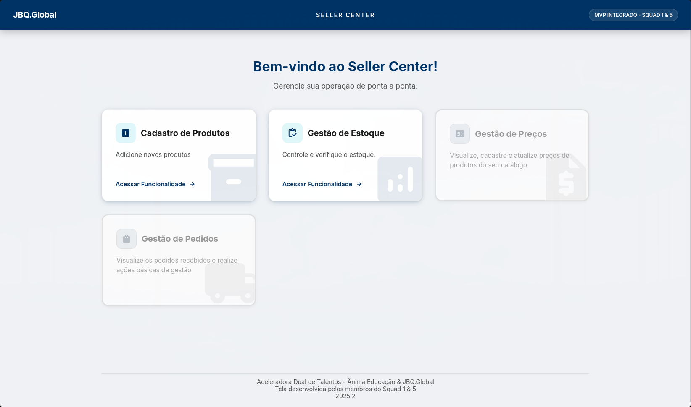
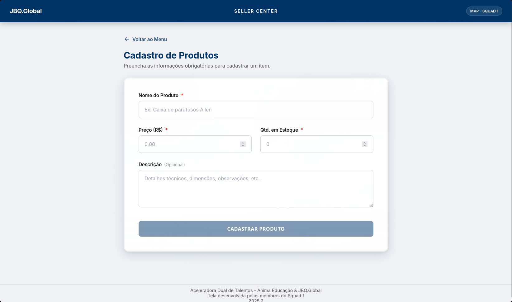
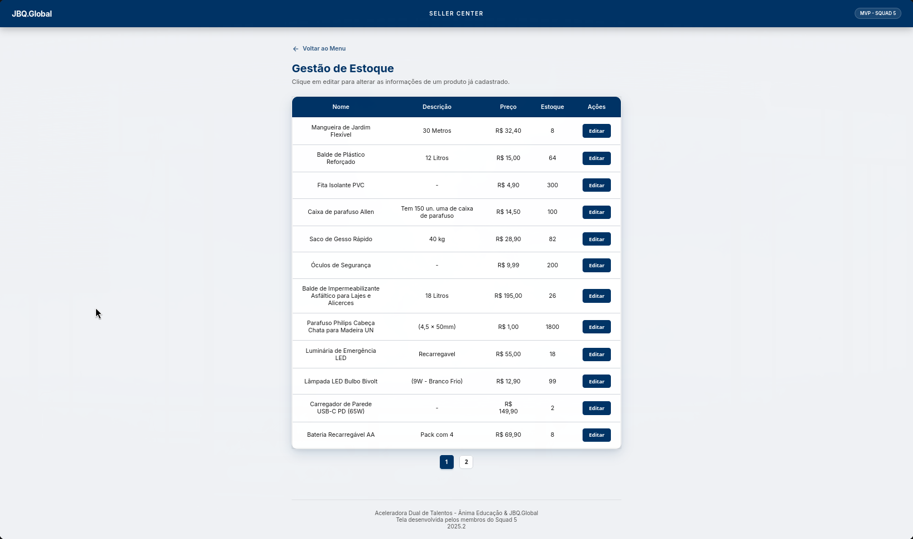

# Projeto JQB.Global - Seller Center

Este projeto é uma aplicação de **Seller Center** desenvolvida no contexto da **Aceleradora Dual**, uma iniciativa da **Ânima Educação** em parceria com a **JBQ.Global**.

O desenvolvimento foi realizado de maneira integrada e colaborativa entre duas squads que compartilham o mesmo time de desenvolvimento, cujas funcionalidades são acessíveis através de uma **Homepage** central desenvolvida pelo time de front-end:

Todas as telas possuem responsividade Mobile funcional.

*   **Squad 1:** Responsável pelo módulo de **Cadastro de Produtos**.
*   **Squad 5:** Responsável pelo módulo de **Gestão de Estoque**.



---
## Tecnologias e Frameworks

### Front-end
*   **HTML5** 
*   **CSS3** 
*   **JavaScript**

### Back-end
*   **Node.js**
*   **Express.js**
*   **MongoDB & Mongoose** 
*   **CORS:** para habilitar requisições de diferentes origens.

---
## Squads e Funcionalidades

### SQUAD 1 - Cadastro de Produtos

#### Liderança
*   **Product Owner (PO):** Amanda Vitoria
*   **Scrum Master (SM):** Jullia Kathelyn

#### Desenvolvimento

*   **Desenvolvimento Front-end:**
    *   Jordan Estevan 
    

*   **Desenvolvimento Back-end:**
    *   Bruno Rodrigues
    *   Felipe Coelho



---

### SQUAD 5 - Gestão de Estoque

#### Liderança
*   **Product Owner (PO):** Alvaro Almeida
*   **Scrum Master (SM):** Jullia Kathelyn

#### Desenvolvimento

*   **Desenvolvimento Front-end:**
    *   Jordan Estevan


*   **Desenvolvimento Back-end:**
    *   Bruno Rodrigues
    *   Jordan Estevan
    *   Felipe Coelho



---
## Dependências e Execução

1. **Backend:**
   Acesse a pasta `backend`, instale as dependências e inicie o servidor:
   ```bash
   npm install
   npm start
   ```

2. **Frontend:**
   O frontend é composto por arquivos estáticos. Você pode abrir o arquivo `frontend/index.html` diretamente no navegador.


